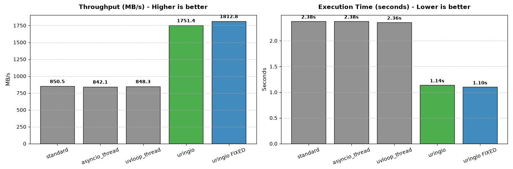
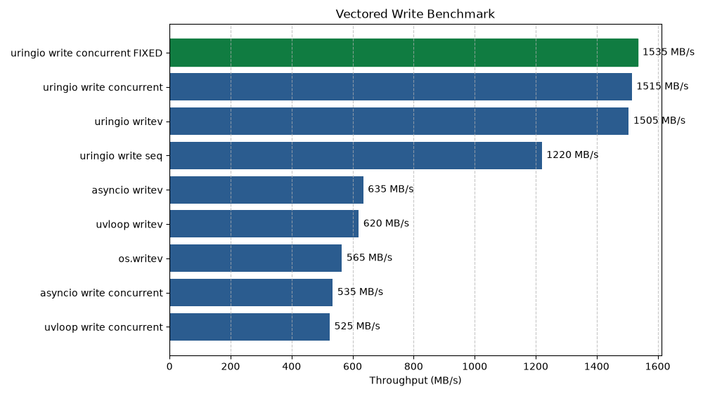
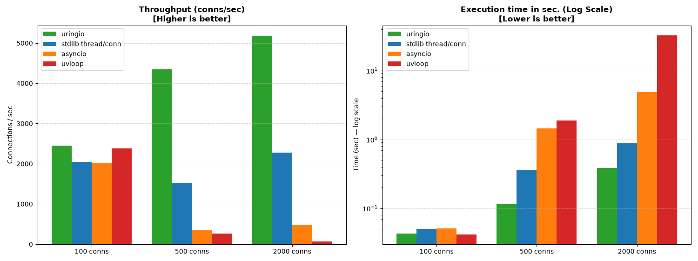
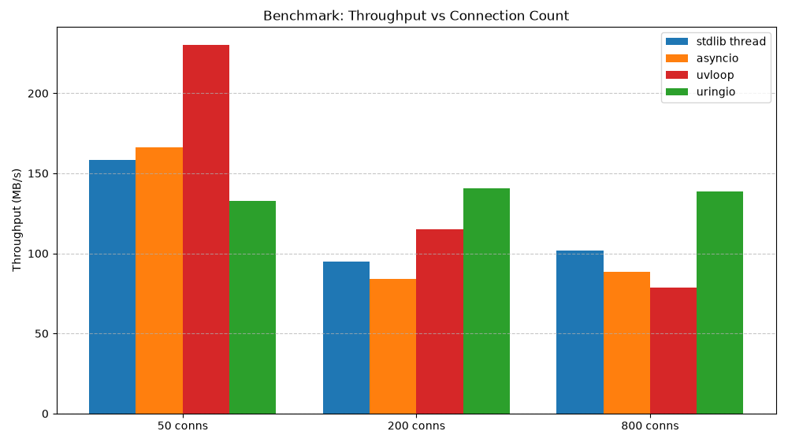

<p align="center">
  
</p>

# uringio
  

uringio brings true asynchronous file I/O to Python with a native event loop built on [io_uring](https://unixism.net/loti/), implemented as C extension for CPython.

⚠️ Currently in active development, so API and internals may change and will be evolved.

## Quick Examples
### Files
```python
import asyncio
import uringio

async def main():
    async with await uringio.open_file(path='testfile.txt') as file:
        data = b'Hello, uringio!\n'
        await file.write(data=data)
        result = await file.read()

asyncio.run(main(), loop_factory=uringio.UringioLoop)
```

### Sockets
```python
import asyncio
import uringio

async def main():
    async with await uringio.prep_socket() as socket:
        await socket.connect('127.0.0.1', 9000)
        await socket.send(b'Hello, uringio!')
        data = await socket.recv()

asyncio.run(main(), loop_factory=uringio.UringioLoop)
```

### `Fixed` buffers - One of io_uring optimization features
```python
import asyncio
import uringio

async def main():
    loop = asyncio.get_running_loop()
    buf = bytearray(4096)
    with loop.buffer_mode(mode=uringio.BUFFER_MODE.FIXED, buffers=[buf]):
        await simple_file_example()

asyncio.run(main(), loop_factory=uringio.UringioLoop)
```

**See the whole [user guide](docs/USER_GUIDE.md)**

**See [API page](docs/API.md)**

**Also, you can watch examples inside `docs/examples` and run them under ASAN with**
> make run-examples

## Benchmarks 
**`uringio` shows that true file async I/O provided by `io_uring` is superior over current solutions and shows x2 and almost x3 performance:**

#### Write files sequentially

#### Write files using vector operations


**`uringio` also shows better performance over other solutions in `socket` operations:**
#### Socket connection storm


**⚠️ But `uringio` and `io_uring` are not a magic wands, so there are scenarios when its better not to use it. For example:**

#### Load test of concurrent TCP connections with I/O operations


As you can see, with little amount of connections there is no reason to use `uringio` because of `CQE`s and `SQE`s overhead. However, when it comes to many connections - it is the only backend that not degrading under pressure.

Read more about benchmark results in [Benchmarks analysis page](docs/BENCHMARKS_ANALYSIS.md)

## Installation
**Warning! Linux only**
uringio requires linux kernel version 6.11 or greater and Python 3.12 or greater.
Library is available on PyPI, so use pip to install it:
> pip install uringio

## Build and use
To build and install use
> make install

You can only build by using
> make build

Run tests:
> make test-all

Run tests under ASAN:
> make test-all-asan

While working with code, dont forget to
> make lint

**Watch more commands in [developer guide](docs/DEVELOPMENT.md) or inside `Makefile`. Currently tested only on Fedora 43 with 7.1.5 kernel version**

## Architecture
### io_uring
uringio is written natively as C extension for CPython and brings the new event loop, based on io_uring.

What is io_uring and how it works, explained shortly by us - [here](docs/IO_URING.md)

### Presenting new objects
- Main:
    - UringioLoop
    - File
    - Socket
- Helpers:
    - BufferModeCtx
    - StreamStrategyCtx
    - TransferModeCtx
    - ExecutionContextCtx
- Enums:
    - BUFFER_MODE
    - STREAM_STRATEGY
    - TRANSFER_MODE
    - PAYLOAD_TYPE
    - Resolve Flags
    - Statx Flags
    - StatxMask

Whole documentation about their purposes and how they work is in [architecture page](docs/ARCHITECTURE.md)

### Structure

Structure of this project is trying to be simple - we have pure c-layer and pure python-layer and layer in between.

- C-layer - Functionality written entirely in C and basically wrappers aroung liburing ABI
- Python-layer - By analogy it is layer, written with usage of CPython API and CPython objects.
- Layer in between - for now here is really only one thing - registry. It is container to hold objects in between. I wish i could say that in between C-layer and Python-layer, but the meaning is not so. We are working with async nature and giving control of the operations to kernel, so we can do our things. To map the result of kernel with what was intended we need some sort of storage - this is registry.

### Domains
- Ring
- Event Loop
- Reader
- OPS
- Buffers
- Execution Context
- Registry
- Timer
- Signals

To read about implementation details, go to [architecture page](docs/ARCHITECTURE.md)

## Contributing

We are looking for help with:

1. Propose new features. You can choose something from our [roadmap](docs/ROADMAP.md) - you can add new checks yourself, but create an issue first.
2. Testing on different Linux Distros/Kernels. If you'll find some issues - create some on GitHub.
3. Sharing experience in memory management, libraries architecture, cpython, io_uring, epoll and many other things.
4. Write tests and benchmarks
5. Report bugs


**Read next**
  - [Contributing guide](CONTRIBUTING.md)
  - [Development guide](docs/DEVELOPMENT.md)
  - [Code of Conduct](CODE_OF_CONDUCT.md)
  - [Security](SECURITY.md)

## Roadmap
See [here](docs/ROADMAP.md)