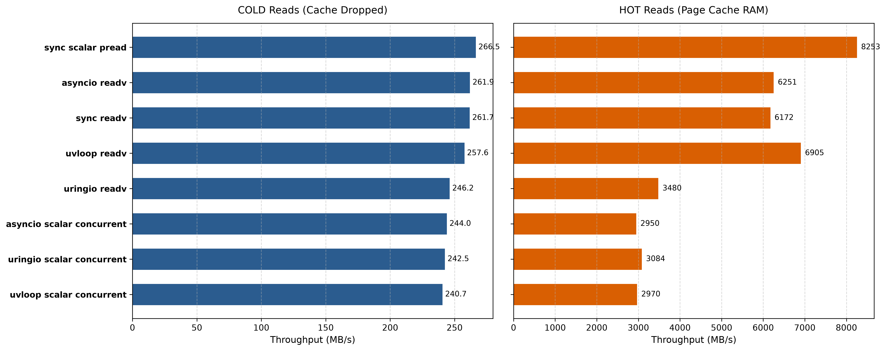
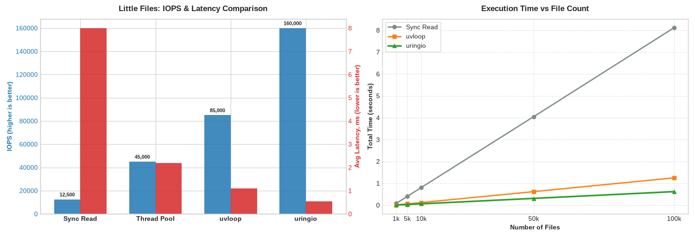
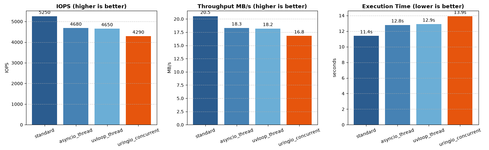

# Benchmark analysis

## Conditions
- Fedora Linux 43 on external SSD
- 250 iterations for each benchmark
- All benchmarks are AI generated, and we're assuming them as initial benchmarks

**One day a hero will come and rewrite this generated benchmarks**  

## TLDR
- **Pros**
    - **Native Async File I/O:** The only backend offering true asynchronous file operations without relying on threadpools.
    - **High Write Performance:** Significantly faster at sequential and vectorized file writes by sending data straight to the kernel's Submission Queue, avoiding blocking syscalls.
    - **Excellent Socket Scalability:** Outperforms `epoll`-based backends (`asyncio`, `uvloop`) during connection storms and handles massive concurrent TCP connections with stable, constant performance.
- **Cons**
    - **Kernel Cache Overhead:** SQE/CQE handling introduces overhead that makes it slower than standard synchronous reads/writes when data is already in the kernel's hot cache.
    - **Low-Scale Inefficiency:** Slower than standard methods for a small number of socket connections due to `io_uring` overhead.
    - **Socket Closure Issues(v0.4.4):** Prone to `OSError 98` (Address already in use) under heavy loads; socket closing logic requires optimization.
    - **Missing Read Optimizations(v0.4.4):** Cold cache reads and random read workloads currently lag behind standard methods and need optimizations like `O_DIRECT` support.

## Benchmarks
### File
**Benchmarks are inside docs/benchmarks/files/**

#### Write files sequentially

##### Results
This benchmark shows strong size of io_uring - it sending data straight to Kernel in Submission Queue and not using blocking file syscalls
##### Benchmark essence
This benchmark evaluates the performance of sequentially writing large amounts of data to disk in a Python environment on Linux. uringio here is the only backend that offers native async operations
##### Compared methods
- Standard synchronous sequential write
- asyncio, running same synchronous script in another thread
- uvloop, running same synchronous script in another thread
- uringio, sequential writing with own implementation of write
- uringio, same thing in Fixed mode

#### Write files using vector operations

##### Results
Another benchmark that shows strong part of uringio - native async file operations is faster that vectored operations in concurrently.
##### Benchmark essence
The test simulates writing a large array of data to disk or a file descriptor using scatter-gather I/O and parallel writing.
##### Compared methods
- Synchronous os.write
- asyncio, running same synchronous script in another thread
- asyncio, running same synchronous script concurrently
- uvloop, synchronous script in another thread
- uvloop, synchronous script concurrently
- uringio, own implementation of writev
- uringio, sequential writing
- uringio, concurrent writing
- uringio, concurrent writing in Fixed mode

#### Read files using vector operations

##### Results
First benchmark that shows that io_uring is not a red pill. When there is no real device I/O operations and data is inside Kernels cache - standard ride operations are not blocking thread and SQE and CQE handling is overhead here. \
However, when data is not inside cache uringio is still a bit slower. I think there is a lot of rooms for optimizations to be faster, for example O_DIRECT support
##### Benchmark essence
The benchmark measures the throughput of vectorized reading of a big file. There is actually two measures - with warmed cache and cold cache  
##### Compared methods
- Synchronous vectored read(one big read)
- Synchronous scalar read(many little read)
- asyncio vectored read
- asyncio scalar concurrent read
- uvloop vectored read
- uvloop scalar concurrent read
- uringio vectored read
- uringio vectored read in FIXED mode
- uringio scalar concurrent read

#### Open/close operation on little files in different depth

##### Results
This benchmark shows quite interesting result - uringio is fastest in context of async writing, but standard synchronous write is much faster.

Its faster because file metadata is stored in the kernel's hot cache. In this scenario, there is no disk latency, and the overhead CQE/SQE is higher than direct system calls.

However, in real server applications, synchronous we cant rely on this layer of cache.
##### Benchmark essence
Evaluating the performance of file operations for open/close multiple small files in Python environment with various levels of depth.
##### Compared methods
- Synchronous approach
- asyncio, same synchronous approach but through threadpool
- uvloop, same synchronous approach but through threadpool
- uringio, the only true asynchronous python backed for file I/O  

#### Many random reads on files

##### Results
This benchmark confirms 2 important points from benchmarks above:
  - All asynchronous backends, including io_uring, did not give boost in cases when all data can be stored in kernel's cache
  - There are rooms for optimizations of `uringio`, because it is quite surprising that it is not the fastest asyncio backend, while it is the only backend with native asyncio support    
##### Benchmark essence
This benchmark simulates a random small read load from the disk. No COLD cache, just straightforward approach
##### Compared methods
- Synchronous read
- asyncio, same synchronous approach but through threadpool
- uvloop, same synchronous approach but through threadpool
- uringio, the only true asynchronous python backed for file I/O  

### Socket
**Benchmarks are inside docs/benchmarks/sockets/**

#### Socket connection storm

##### Results
This benchmark shows how uringio, by its io_uring nature, is optimized for scaling with the lowest latency and highest speed. \
But also there is a thing that chart above dont show - we need some optimization for fastest socket closing, because in a lot of cases there were OSError98  
##### Benchmark essence
This benchmark is measuring time that need for establishing, transmitting data, and closing 100/500/2000 connections.
##### Compared methods
- stdlib socket handling. 1 thread = 1 connection
- asyncio, concurrent socket handling. Based on epoll
- uvloop, concurrent socket handling. Based on epoll
- uringio, concurrent socket handling. Based on io_uring

#### Load test of concurrent TCP connections with I/O operations

##### Results
Quite interesting results with two conclusions:

- On little amount of connections there is no need to use io_uring based backends - SQE/CQE handling is overhead here 
- But with increase of connections uringio is faster than others, and its performance keeps almost on constant level

But also there is a thing that chart above dont show - we need some optimization for fastest socket closing, because in a lot of cases there were OSError98. See the [issue](https://github.com/AivazianArtur/uringio/issues/26)
##### Benchmark essence
Load testing of TCP echo server in fanout mode - parallel concurrent connections sending and receiving data
##### Compared methods
- stdlib socket handling. 1 thread = 1 connection
- asyncio, concurrent socket handling. Based on epoll
- uvloop, concurrent socket handling. Based on epoll
- uringio, concurrent socket handling. Based on io_uring
