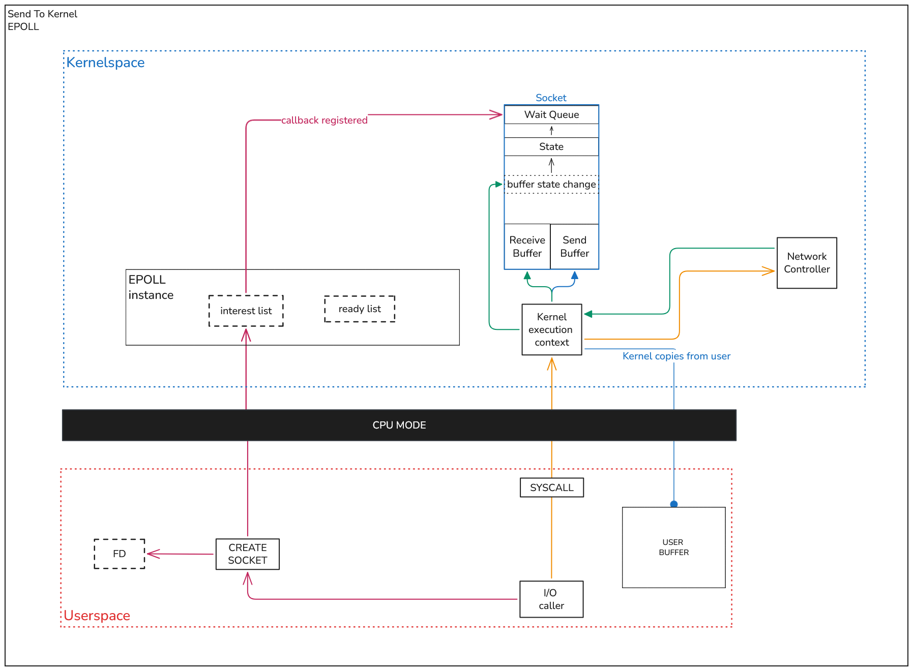
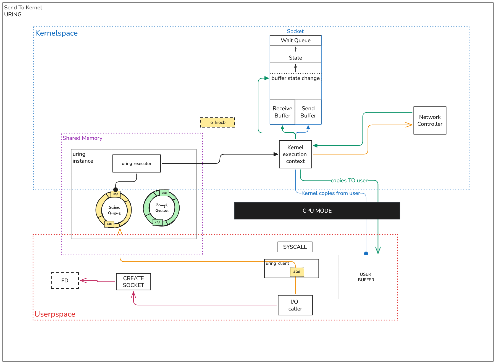
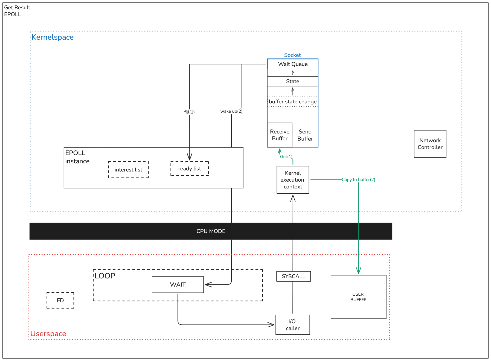
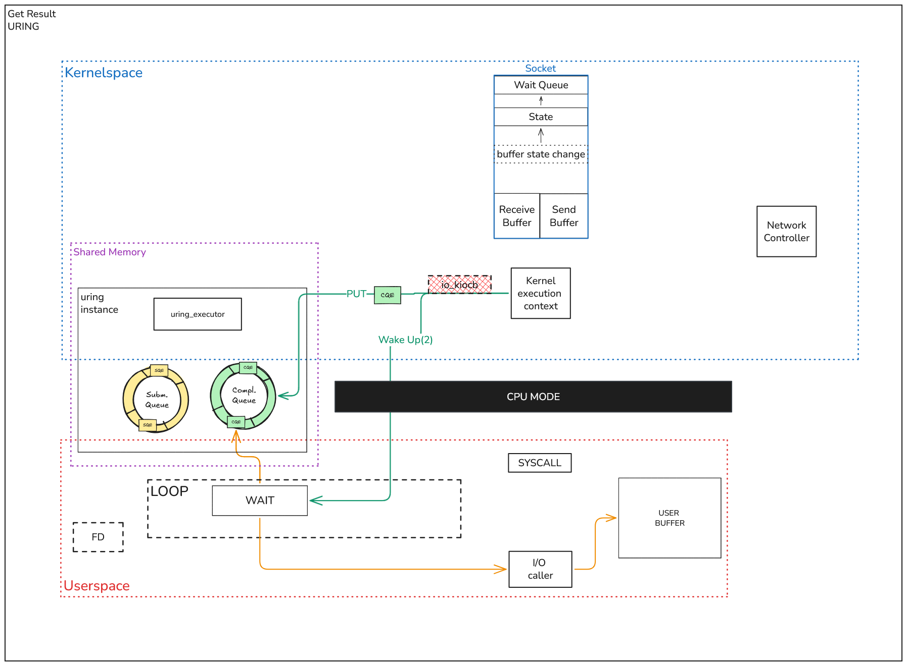

# io_uring
**io_uring is an efficient Linux implementation of the Proactor I/O model**

Main way to interact with io_uring is [liburing](https://github.com/axboe/liburing), and `uringio` use it too.

**If you are already familiar with io_uring, you can go to: [Architecture page](docs/ARCHITECTURE.md)**

## Specific concepts
- **io_uring** - Linux API for async I/O, implements proactor pattern
- **ring** - Instance of io_uring, contains two buffer rings - Submission Queue and Completion Queue
- **Submission Queue [SQ]** - Queue buffer that acts as input topic - app writes async operation there, kernel read out of there
- **Completion Queue [CQ]** - Queue buffer that acts as output topic - kernel writes result of done operation there, app read out of there

**More about these topics: - [man page](https://man7.org/linux/man-pages/man7/io_uring.7.html), [lords of io_uring](https://unixism.net/loti/what_is_io_uring.html)**

- **Submission Queue Entry [SQE]** - Object, that wraps input data for Submission Queue. SQE is a record for SQ

**Links to learn more: [lords of io_uring.SQE](https://unixism.net/loti/ref-liburing/sqe.html)**

- **Completion Queue Event [CQE]** - Object, that wraps input data for Completion Queue. CQE is a record for CQ

**Links to learn more: [lords of io_uring.CQE](https://unixism.net/loti/ref-liburing/cqe.html)**

- **Fixed Buffer** - Optimization workaround for user buffers, to not send buffer with every operation. User register buffers, and then should only track their indexes and send this indexes. Reduces need of copy-pasting buffer data around user and kernel space.

**Links to learn more: [lords of io_uring.Fixed Buffers](https://unixism.net/loti/tutorial/fixed_buffers.html)**

- **Provided Buffer** - Another optimization. Here is user register buffers, and io_uring even handler their indexes.

**Links to learn more: [man page](https://man7.org/linux/man-pages/man7/io_uring_provided_buffers.7.html)**

- **Buffer Ring** - One more optimization, created specifically to optimize Provided Buffers mechanism.

**Links to learn more: [man page](https://man7.org/linux/man-pages/man3/io_uring_register_buf_ring.3.html)**

- **Multishot** - Allows one SQE to generate multiple CQE on some trigger-event.

**Links to learn more: [man page](https://man7.org/linux/man-pages/man7/io_uring_multishot.7.html)**

- **Zero-copy** - Reduces CPU load on copying data between kernel and user-space.

**Links to learn more: [man page](https://man7.org/linux/man-pages/man3/io_uring_prep_send_zc.3.html)**

## Short visualized explanation:
### `io_uring` provides two shared buffers:
* Submission Queue - Where apps pushes I/O requests.
* Completion Queue - Where kernel pushes I/O responses.

**The core difference between this and standard reactor model using epoll is that proactor models provides solutions to reduce system calls for getting result.** \
**Also, rings are placed inside shared memory, while epoll is inside kernel memory.**

Let's look at this difference by looking at diagrams of two phases:
1. Sending to kernel
2. Getting result

### Sending to Kernel 
#### Epoll

1. First, you`re creating socket and getting fd.
2. By passing fd, socket is registered in epoll's interest list + in socket's `Wait Queue` is passing callback.
3. Then user is making I/O operation. At this point, all user's information is in `User Buffer`.
4. Syscall is coming to kernel through CPU.
5. Kernel copies from `User Buffer` to socket's `Send Buffer`.
6. Kernel is executing command, for example - send to `Network Controller` (abstraction).
7. When controller returns to kernel, it saves result to socket's `Receive Buffer`.

#### Uring

1. First, you`re creating socket and getting fd.
2. Then user is making I/O operation. At this point, all user's information is in `User Buffer`.
3. Before making syscall, uring client is creating `SQE`.
4. Then syscall is making to said Kernel: 'Data is inside `Submission Queue`'.
5. Rings are structures in shared memory, but uring also have helpers. Here let's call all of them just `uring_executor`.
6. `uring_executor` is creating `io_kiocb` object. This is complex object, that provides functionality to kernel create retry callback and return callback. Lives only in kernel.
7. Kernel copies from `User Buffer` to socket's `Send Buffer`.
8. Kernel is executing command, for example - send to `Network Controller` (abstraction).
9. When controller returns to kernel, it saves result to socket's `Receive Buffer`.
10. Most important part: kernel is making transaction to/from `User Buffer` from/to `Socket Buffer`. Asynchronously!

### Getting Result 
#### Epoll

1. At this point, state of socket is changing and callback inside `Wait Queue` are calling.
2. This callback makes two things:
   1. Fills ready list with result
   2. Calls `wake up`.
3. Component that waits for result, for us it is `loop`, is says to app - `you can get result`
4. App is making syscall to kernel.
5. Kernel gets content of `Receive Buffer`.
6. Kernel copies result to `User Buffer`.

#### Uring

0. After writing to `User Buffer`.
1. Kernel creates CQE and sends it straight to `Completion Queue`.
2. Kernel destroys `io_kiocb`.
3. Kernel calls `wake up` to app - loop.
4. Loop is getting CQE.
5. Loop says to app - `you can get result`.
6. Data is already in user buffer - use it

Those diagrams are showing the simplest configurations of both `epoll` and `uring`.
Both system can be more optimized by implement alternative for `wake up`, buffer optimizations, setting retires and more from the box.

## Conclusions
To simplify, we can write schemes like this:

epoll:
> task -> epoll wait for fd -> fd ready -> read() syscall -> done

io_uring:
> task -> submit SQE -> kernel did read() syscall -> CQE -> done

| Feature      | Epoll (Reactor)                     | io_uring (Proactor)              |
|--------------|-------------------------------------|----------------------------------|
| Notification | "It's ready, you do it."            | "It's done, here is the result." |
| Syscalls     | 2+ (Wait + Read/Write)              | 1 (Submission)                   |
| Data Copy    | Synchronous (blocks CPU)            | Asynchronous (Kernel handles it) |
| Thread Usage | Often needs a thread pool for files | Truly single-threaded async      |
| Location     | Context resides in Kernel Space     | Queues are in Shared Memory      |
| Data Copy    | App copies data                     | Kermnel copies data              |
